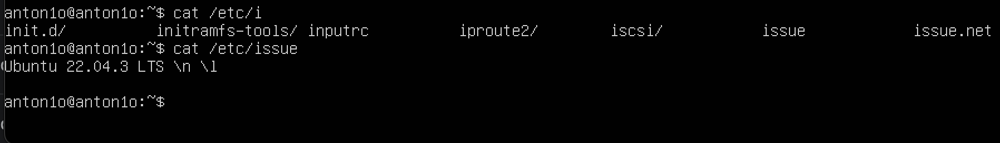
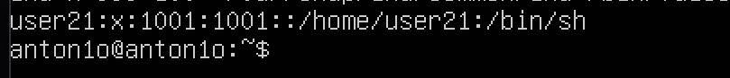
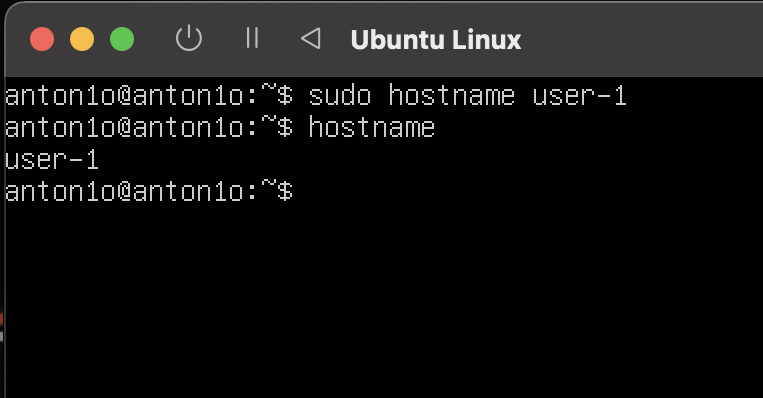
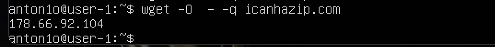
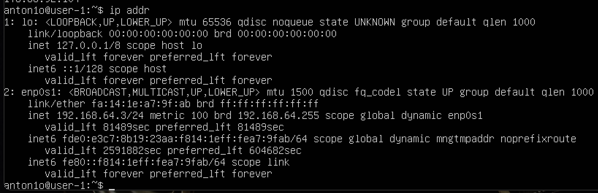
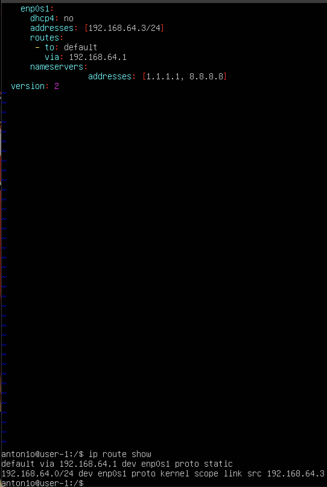
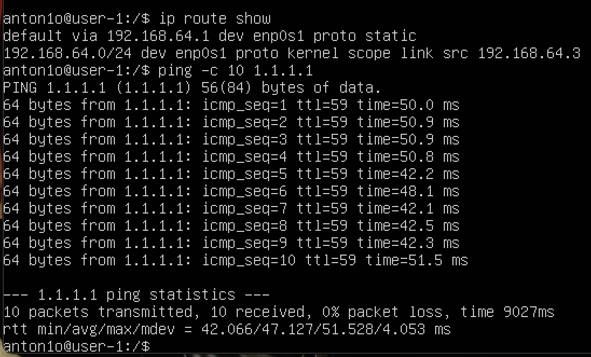
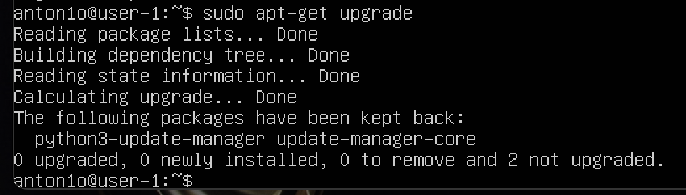
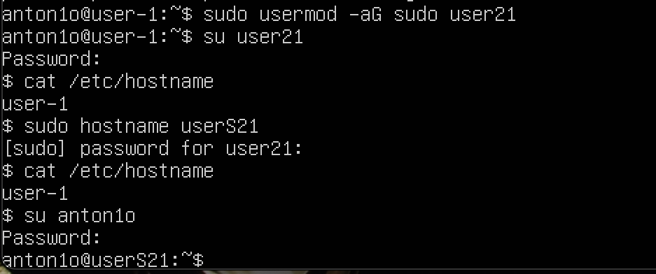
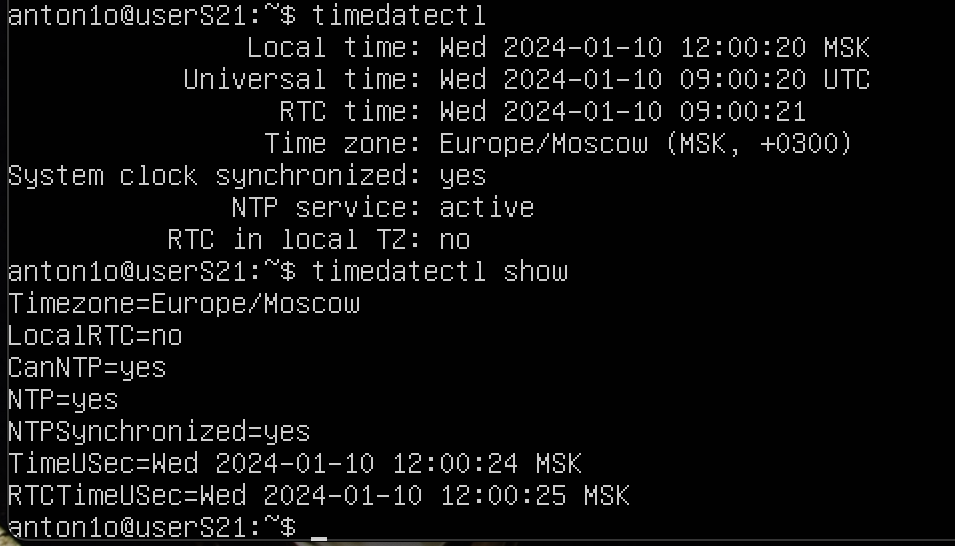

## Part 1. Установка ОС
1. Узнаю версию Ubuntu, с помощью команды:
-cat /etc/issue.

## Part 2. Создание пользователя
1.  Создаю нового пользователя и добавляю его в группу adm

2. Вывод команды: 
-cat /etc/passwd

## Part 3. Настройка сети ОС
1. Задать название машины вида user-1               
Создал новый (hostname - user-1) с помощью команды:           
-sudo vim /etc/hostname              
И делаю перезагрузку:
-reboot        

2. Установил временную зону, которая соответствует текущему положению:        

3. Вывел названия сетевых интерфейсов с помощью консольной команды:
-ifconfig       

* lo (local loopback - локальная петля). Служит для подключения по сети к этому же компьютеру и не требует дополнительной настройки.
4. С помощью консольной команды получаю ip адрес устройства, на котором работаю, от DHCP сервера:
-hostname -I        

* Dynamic Host Configuration Protocol (DHCP) — автоматический предоставляет IP адреса и прочие настройки сети (маску сети, шлюз и т.п) компьютерам и различным устройствам в сети.
5. С помощью команды узнаю свой внешний ip-адрес шлюза:
-wget -O - -q icanhazip.com        

C мощью команд узнаю внутренний IP-адрес шлюза, он же по умолчанию: 
-ip addr или -ip route       

6. Чтобы задать статичные найтройки, нужно изменить файл с помощью команды:        
-sudo vim /etc/netplan/00-installer-config.yaml        

После пропинговываю удаленные хосты 1.1.1.1 и ya.ru:        
        

##  Part 4.  Обновление ОС
1. Обновляю системные пакеты до последней версии командой:
-sudo apt-get upgrade

## Part 5. Использование команды sudo
1. Разрешаю пользователю, созданному в Part 2, выполнять команду sudo. Для этого использую команду:
-sudo usermod -aG sudo user21  
С помощью команды: -su переключаюсь на новую учетную запись и поменял hostname

* Sudo — это утилита, предоставляющая привилегии root для выполнения административных операций в соответствии со своими настройками. Она позволяет легко контролировать доступ к важным приложениям в системе. По умолчанию, при установке Ubuntu первому пользователю (тому, который создаётся во время установки) предоставляются полные права на использование sudo. Т.е. фактически первый пользователь обладает той же свободой действий, что и root. 

## Part 6. Установка и настройка службы времени
1. Вывожу корректное время командой:
-timedatectl show

## Part 7. Установка и использование текстовых редакторов
1. Установить текстовые редакторы, нужно было установить только редактор joe, vim и nano уже были установлены: 
-sudo apt install joe

###VIM
1.   
2. 
3. 
4. 
* Создаю файл vim test_VIM.txt     
* Выхожу из режима редактирования и сохраняю файл: нажимаю esс и ввожу :wq     
* Выход без сохранения: :q!        
* Поиск: /<текст, который хотим найти>    
* Замена: :s/<что хотим изменить>/<на что хотим заменить>

### NANO
1. 
2.       
3. 
4. 
5. 
6. 
* Создаю файл nano test_NANO.txt       
* Выхожу с сохранением: "control+O", затем нажимаю "enter"
* Выход без сохранения: "control+X", затем "N (no)"      
* Поиск: "control+W", затем пишу нужное слово и нажимаю "enter"
* Замена: "control+\" <"что хотим изменить" + "enter"> + <"на что хотим заменить" + "enter"> + "Y" или "N" применить, или отклонить 

### JOE
1. 
2. 
3. 
4. 

* Создаю файл joe test_mcedit.txt       
* Сохранить и выйти "control+K+X"
* Выйти без сохранения "control+C"
* Поиск: "control+K+F", пишу нужно слово/цифру нажимаю на "B" и "enter"
* Замена : "control+K+F", пишу нужно слово/цифру нажимаю на "R" и "enter", после выбираю на что заменить, и выбираю "Y" "N"

## Part 8. Установка и базовая настройка сервиса SSHD
1. Установливаю службу SSHd.
-sudo apt-get install ssh
-sudo apt install openssh-server

2. Добавляю автостарт службы при загрузке системы и проверяю статус.
-sudo systemctl enable ssh
-systemctl status ssh

3. Перенастраиваю службу SSHd на порт 2022 и перезагружаю ssh-сервер, чтобы изменения вступили в силу.
-sudo vim /etc/ssh/sshd_config
-systemctl restart sshd

4. Использую команду ps, для отображения процесса sshd
-ps -A | grep sshd

* ps (показывает запущенные процессы, выполняемые пользователем в окне терминала);
* ps -e или ps -A (Чтобы просмотреть все запущенные процессы);
* ps -d (Чтобы показать все процессы, кроме лидеров сессии);
* ps -d -N (можно инвертировать вывод с помощью переключателя -N. Например, если хочу вывести только лидеров сеансов)
* ps T (увидеть только процессы, связанные с этим терминалом);
* ps r (просмотреть все работающие (running) процессы);
* ps -p 'pid' (если вы знаете идентификатор процесса PID, вы можете просто использовать следующую команду, для вывода процесса с этим 'pid');
* ps -p 'pid1' 'pid2'
* ps U 'userlist' (найти все процессы, выполняемые конкретным пользователем);
* ps -ef (получить полный список);
5. Перезагрузить систему
Вывод команды -netstat -tan

* -t (--tcp) отображает соедниеня только по tcp
* -a (--all) вывод всех активных подключений TCP 
* -n (--numeric) вывод активных подключений TCP с отображением адресов и номеров портов в числовом формате
* Proto: Название протокола (протокол TCP или протокол UDP);
* recv-Q: очередь получения сети
* send-Q: Сетевая очередь отправки
* Local Address адрес локального компьтера и используемы номер порта
* Foreign Address адрес и номер удаленного компьтера к которомц подключен сокет
* State состояние сокетв
* 0.0.0.0 означает IP-адрес на локальной машине

## Part 9. Установка и использование утилит top, htop
1. Отчёт команды top:
* uptime - 1hour12min;
* количество авторизованных пользователей - 1;
* общую загрузку системы - 0.00, 0.00, 0.00
* общее количество процессов - 117;
* загрузку cpu - 0.1%;
* загрузку памяти - 168/7,74G;
* pid процесса занимающего больше всего памяти - 678 (top -o %MEM);
* pid процесса, занимающего больше всего процессорного времени - 1540 (top -o %CPU);
2. Скрины с выводом команды htop:
* отсортированному по PID, PERCENT_CPU, PERCENT_MEM, TIME

* отфильтрованному для процесса sshd

* с процессом syslog, найденным, используя поиск

* с добавленным выводом hostname, clock и uptime

## Part 10. Использование утилиты fdisk
1. Запустить команду fdisk -l.

* название жесткого диска - (Не показывает название);
* размер - 32GiB;
* количество секторов - 67108864;
* размер swap - 3.0Gi. (Для этого пришлось создать файл подкачки) 

## Part 11. Использование утилиты df
1. Запустить команду df /.
* размер раздела - 14830568;
* размер занятого пространства - 6355200;
* размер свободного пространства - 7700200;
* процент использования - 46%;   
Определить и написать в отчёт единицу измерения в выводе - килобайт
2. Запустить команду df -Th.   
* размер раздела - 15G;
* размер занятого пространства - 6.1G;
* размер свободного пространства - 7.4G;
* процент использования  - 46%   
Определить и написать в отчёт тип файловой системы для раздела - ext4.

## Part 12. Использование утилиты du
1. Запустить команду du.

2. * Вывести размер папок /home, /var, /var/log (в байтах)

* Вывести размер папок /home, /var, /var/log (в человекочитаемом виде)

3. Вывести размер всего содержимого в /var/log (не общее, а каждого вложенного элемента, используя *)

## Part 13. Установка и использование утилиты ncdu            
1. Установить утилиту ncdu.    
-sudo apt-get install ncdu    
Вывести размер папок /home, /var, /var/log.

## Part 14. Работа с системными журналами   
sudo vim /var/log/dmesg     
sudo vim /var/log/syslog          
sudo vim /var/log/auth.log          

1. Время последней успешной авторизации, имя пользователя и метод входа в систему (14:16:32; anton1o by LOGIN)

2. Перезапускаю службу SSHd командой:    
-sudo systemctl restart ssh
3. Cкрин с сообщением о рестарте службы (искать в логах).

## Part 15. Использование планировщика заданий CRON
1. Пишу команду, чтобы сгенерировать новую таблицу cron.Команда: -crontab -e (На выбор дается 9 редакторов, выбираю nano). В конце прописываю "*/2 * * * *uptime", чтобы каждые две минуты выводилась информация о том, как долго работает система.

* С помощью запроса: -cat /var/log/syslog вывел системный журнал о выполненой запланированной задачи.

* С помощью команды: -crontab -l посмотрел текущую задачу.

2. Командой: -crontab -r удалил задачу. И командой: -crontab -l увидел, что поставленых задач нету.
